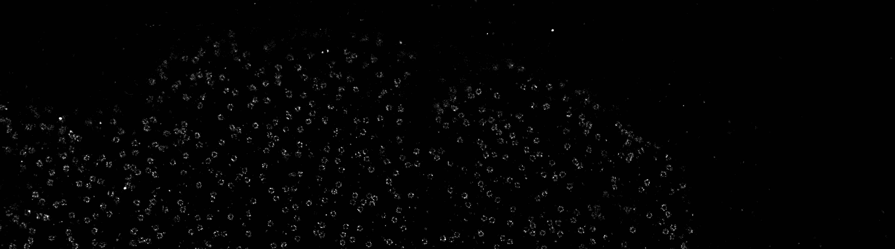
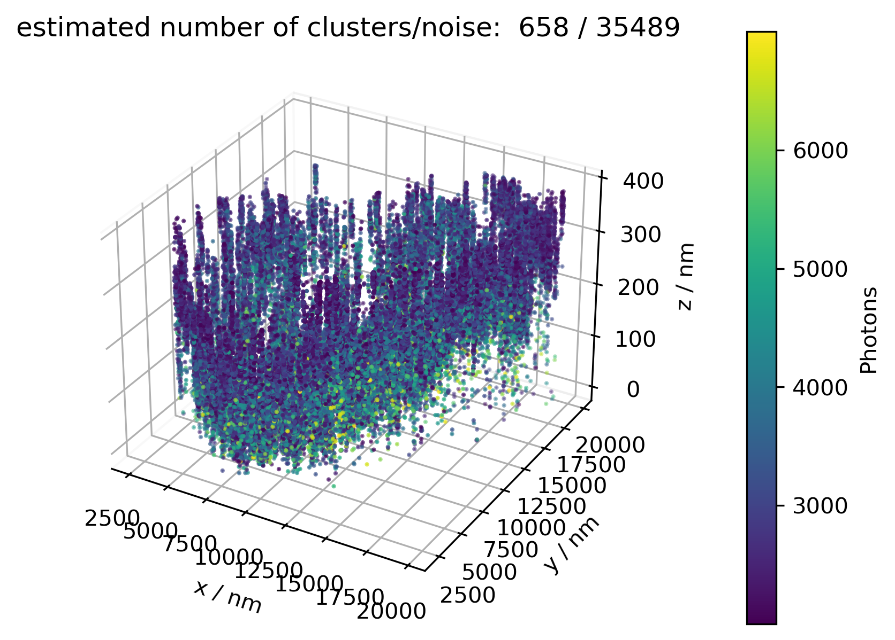
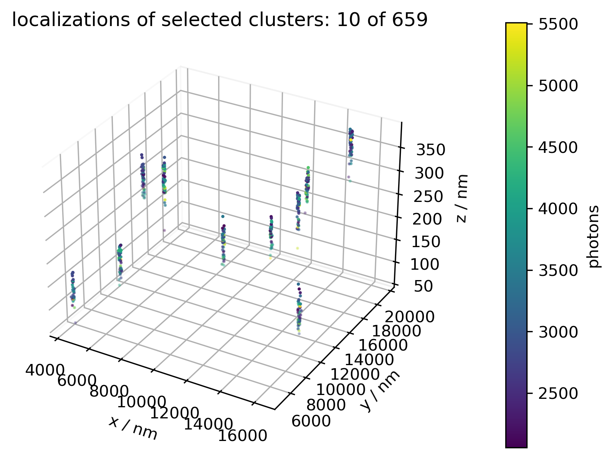
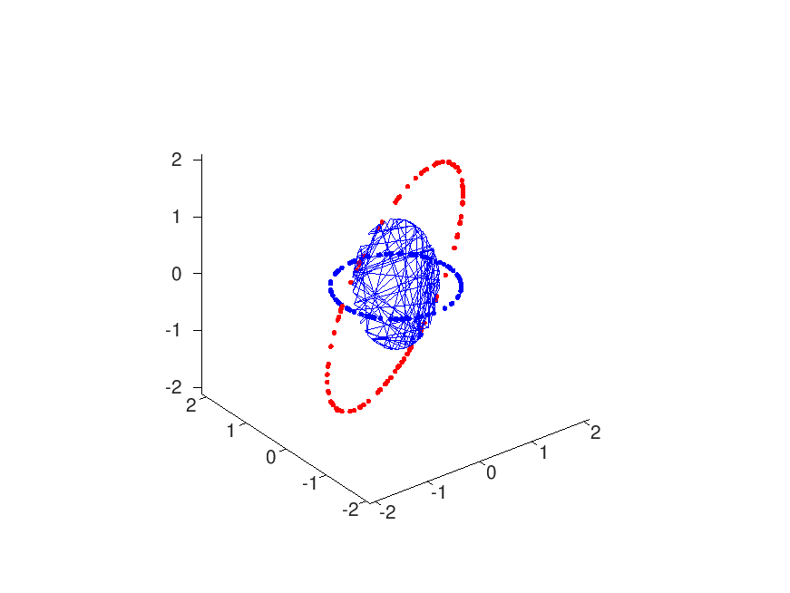
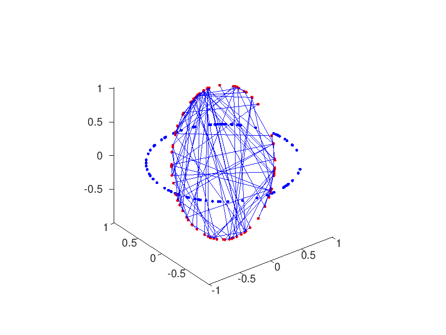

# Dual Colour Three Dimensional Single Molecule Localisation Fluorescence Microscopy

This is the Repo of my Student Project (Projektarbeit) at the
[Biophysics](https://biophysics.iap.tuwien.ac.at/home/) group at the
TU Wien 2021. The final thesis is found as `readme.pdf`, which acts as
a tutorial for the programs listed here and to analyse the example
data. The described programs roughly divide into the two following
groups:

## Three Dimensional Single Molecule Localisation Microscopy Analysis

A Documented walkthrough with examples:
- npc_clustering.ipynb
- npc_clustering.py

 | 

## Dual Colour Projection

A Octave bundle for rigid & affine projections in 3d euclidean space:
- cockpit.m
- ampel.m
- dbscan.m
- rig.m
- affine.m

 | 

### Cockpit
To begin with, *cockpit.m* acts as a framework for the entire analysis;
successively loading the content of all lokal 2d location files
(unless specifically excluded using the exclude variable). All
parameters for further analysis are confined to the settings block at
the beginning, e.g. load-order corrections due to frames being
skipped, etc.

### Sort
The function *ampel.m* sorts (modulo) the positions in three
categories---red, blue, empty---based on the frame, in which the
respective positions have been found by prior localisation. The
illumination order (e.g. red-blue-empty) has to stay constant, but the
offset (which one of the three staging the starting frame) can, and
unfortunately currently has to be adjusted for each file manually by
specifying mod values.

### Cluster
The three separate channels red/blue/empty are then clustered by
*dbscan.m*, based on two parameters: euclidean distance between two
neighbours (eps), and least number of points required to be considered
a cluster at all (minpts). Based on these parameters, some ensemble of
dots are considered a cluster while others are not, which is the whole
point of these routines. Naturally, the number of clusters vary with
different data sets. Unfortunately though, a rigid projection demands
sets of the same size! Brief parameter tuning reveals: Whatever
parameters, some regions most likely will have to be
excluded. Additionally said clustering takes a long time, due to the
slow octave routine; this may be improved by switching to some other
(parallel computed) compiled routine. Even worse, clustering generally
is very dimension sensitive, so performance is about to drop
drastically if we move to 3d!

### Project
Each of these, say 25, clusters is subsequently approximated by its
centroid (arithmetic mean), leaving two sets red/blue of 25
coordinates each. The function *rig.m* now performs a least squares
approximation for the rotation/translation that best projects the blue
to the red set. Unfortunately this function does not work in 3d.
subsequent statistical analysis on the rotation matrices r and the
translation vectors t, of the distinct regions (position files) assert
that the red and blue channels are indeed and globally transformed
rigidly.

### Analyse
Brief analysis leads to the conclusion that the transformation is
somewhat euclidian, but to be honest; the spread (based on mean and
standard deviation) is not too great:
- theta = 0.0007 +/- 0.0004 rad
- deltax = 34 +/- 8 nm
- deltay = 29 +/- 4 nm
